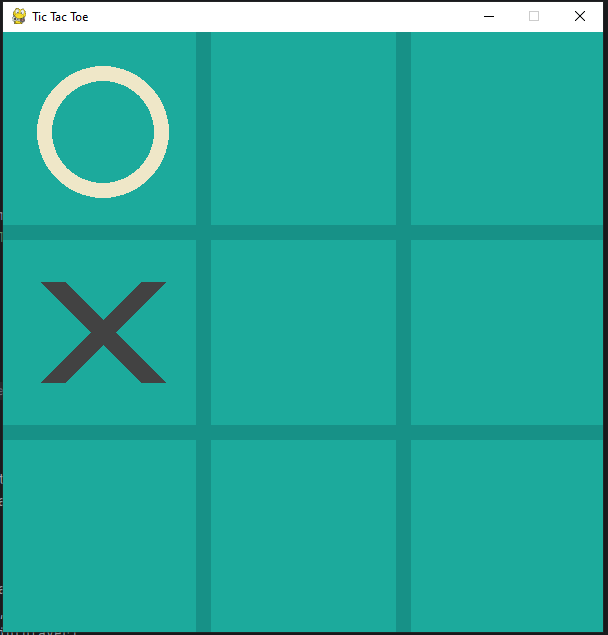

# Tic tac toe
Simple tic tac toe game using `pygame` library for interface

To launch it you should run in console
```bash
git clone https://github.com/RomanHlodann/tic-tac-toe
cd tic-tac-toe
python -m venv venv
On mac: source venv/bin/activate Windows: venv/Scripts/activate
pip install -r requirements.txt
```
After that simply run `main.py` file


